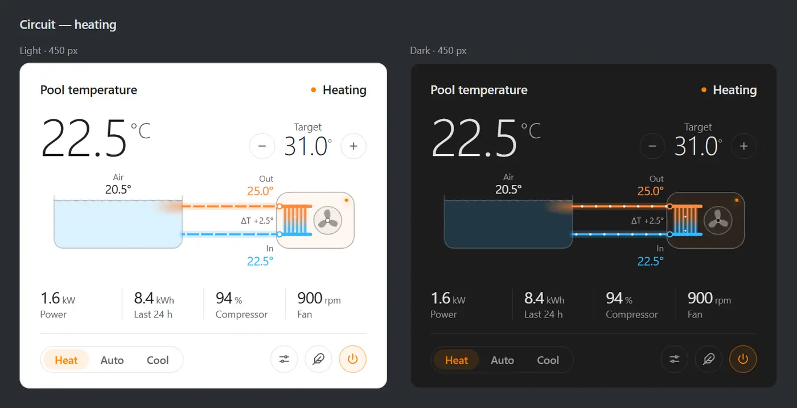
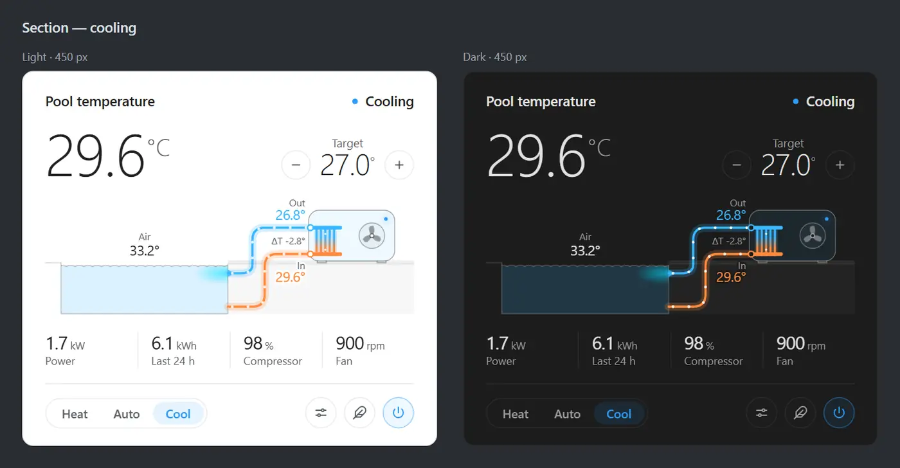

# SPO Pool Heat Pump (Modbus RTU over RS-485 via USR-DR164)

Control an inverter pool heat pump from Home Assistant **on your LAN** — no AquaTemp cloud, no phone app, no internet.

Pumps that ship with **Aqua Temp WiFi** already speak **Modbus RTU on RS-485** on that same port. This integration sits on that wire through a **USR-DR164** (transparent TCP Server). It is the only Modbus client — do not add Home Assistant’s core Modbus integration.

Requires Home Assistant 2026.6.0 or later. You get a Device with `climate`, sensors, switches, and timers, plus a Lovelace card (Circuit or Section schematic). Service-menu values live in the card Settings dialog, not as entities.

**Hardware.** A **USR-DR164** on the factory RS-485 port for Home Assistant. A cheap USB RS-485 stick (**UTS-T02** or similar) if the pump is not fully supported yet or you need to debug.

**New or incomplete pumps.** Start with a listen-only wire capture: [RS-485 ModBus dump](tools/rs485-dump/README.md). Once you have dumps you may share them and [open a feature request](https://github.com/spongioblast/spo_pool_heat_pump/issues/new).

Protocol, write path, DR164 timing, tests, and the simulator: [docs/development.md](docs/development.md). Adding a profile: [docs/profiles.md](docs/profiles.md).

## Supported heat pumps

The Aqua Temp **phone app** does not prove this integration will work. The outdoor board must speak one of the RS-485 patterns below. Pick by how the unit talks, not only the sticker.

| On the case | Status | Pick in setup |
| --- | --- | --- |
| **MIDA Cosma** 13 / 20 / 28 / 35, **Azuro**, **Mountfield** | **Verified** on a live Cosma | MIDA Cosma |
| Hayward, Oasis, Warmpool, ECPI, irriPool | Same Cosma-style bus, not live-tested here | Hayward |
| PHNIX Mini / SuperMini / SpecialLine, Thermotec | Shipped map, not live-tested | PHNIX Mini |
| Fairland / Norsup CN13 | Shipped map, not live-tested. Polled, slave **50** (menu H37) | Fairland CN13 |
| Fairland IPS Pro / InverX / IPHCR | Shipped map, not live-tested. Polled, slave **1** | Fairland IPS Pro |
| Not listed, or setup cannot pick a profile | Capture only — no decode, no write | **Unknown heat pump — dump only** |

**Verified** means Home Assistant talks as a second display. Reads and everyday writes (mode, heat setpoint, quiet; the same path also does power, timers, and cool/auto) were measured on a live Cosma.

Leave **Allow changing service settings** off on every untested map.

**Not this wire** — different bus or cloud only: Hayward EnergyLine Pro / Trevium / Majestic / CPAC, Poolex Dreamline (NET) or Jetline, Welldana Aquagreen / EasyLine, PHNIX MegaLine, MIDA Joy / Poolsana InverPro, Fairland iGarden / Tuya SmartPool.

Full badge → profile list: [docs/profiles.md](docs/profiles.md). Missing functions or a pump not in the table: [need a raw bus dump](#unsupported-or-incomplete-heat-pump--need-a-raw-bus-dump).

## What it looks like

Circuit is the default schematic. Section is the cutaway. Both follow the Home Assistant theme (light / dark).

**Circuit — heating**



**Section — cooling**



## Wire the DR164

The factory WiFi / DTU port already has the four pins the DR164 needs — **+**, **A**, **B**, **G**. The DR164 runs in parallel on that port and takes 12 V from the pump. No extra power supply. Four wires, one per pin. Do not cut the panel cable.


Swap A and B if every frame fails CRC. The DR164 accepts 5–36 V, so the pump’s 12 V is in range.

The factory WiFi / DTU module can stay plugged in or not. The default write path does not use it.

## Put the DR164 on the LAN

1. Power the DR164. Join the open AP `USR-DR164-xxxx` from a phone.
2. Open `http://10.10.100.254` → `admin` / `admin`. Change that password before it sits on the home LAN.
3. Set **STA** Wi-Fi to the home SSID. Apply and wait for the reboot onto the LAN.
4. Reserve the DHCP lease (or set a static IP) on the same subnet as Home Assistant.
5. Leave the phone AP. Browse to that reserved IP for the work-mode settings below.

Home Assistant and the DR164 must be on the same LAN. One TCP client only — do not point a second app at port 8899 at the same time.

## Set the DR164 work mode

On the DR164 web UI (save and restart after these pages):

1. **Serial Setting:** **9600 8N1**, CTSRTS Disable, Pack Interval **20** (leave the factory value — do not set 10), Pack Size **1400**, Com Heart **OFF**, ModBUS Enabled **OFF**.
2. **Net Setting → Socket A:** **TCP-Server**, Port **8899**, Net heart **OFF**, Reg Set **OFF**. Not Modbus gateway, MQTT, HTTP, or PUSR cloud.
3. **Event off** (there is no web switch). From any UDP tool on the LAN, to the DR164 IP port **48899**:
   1. Send `www.usr.cn` (it answers `IP,MAC,USR-DR164`).
   2. Send `+ok` (no line ending).
   3. Within 30 s send `AT+EVENT=off\r\n`, then `AT+Z\r\n`.
   Check with `AT+EVENT\r\n` (`+ok=off`).

   Or from this repository (Python 3, nothing to install): `python tools/dr164_event_off.py 192.168.x.x` — on Windows, `tools\dr164_event_off.cmd 192.168.x.x`. No IP lists modules that answer a broadcast. `--check` queries only.

Port `8899` is ready. Use the reserved LAN IP in the next step.

## Add it to Home Assistant

This is a **HACS** custom integration (Home Assistant Community Store). It is not a Core add-on and not in the HACS default store. Host in setup is the reserved DR164 IP from above.

1. Install [HACS](https://hacs.xyz) if you do not have it yet.
2. **HACS → ⋮ → Custom repositories**.
3. Repository: [https://github.com/spongioblast/spo_pool_heat_pump](https://github.com/spongioblast/spo_pool_heat_pump). Type: **Integration** → Add.
4. HACS → search **SPO Pool Heat Pump** → **Download**. A GitHub Release is used if one exists; otherwise HACS follows `main`.
5. **Restart** Home Assistant.
6. **Settings → Devices & services → Add integration → SPO Pool Heat Pump**. Host = the reserved DR164 IP, port `8899`. Setup listens a few seconds and picks a profile — keep it unless [Supported heat pumps](#supported-heat-pumps) says otherwise. Leave **Write path** on **Second panel (slave 2)** and **Allow changing service settings** off.
7. Add the card to a dashboard: **Edit dashboard → Add card**, search **SPO Pool Heat Pump**. Reload the browser tab after the restart so the card module loads. Do not add a Lovelace / Dashboard resource.

If the reserved IP or port changes later, use **Reconfigure** (host and port only). Profile and write path stay under **Configure**. Do not add Home Assistant’s core **Modbus** integration.

### Manual install

Copy **only** `custom_components/spo_pool_heat_pump` into `<config>/custom_components/` and restart, then from step 6 above. Do not copy `tools/`, `tests/`, `ha-docker/`, or `card-src/` — HACS does not install those either.

## Options

| Parameter | Where | What it is |
| --- | --- | --- |
| Host | Add / Reconfigure | Reserved LAN IP of the USR-DR164 |
| Port | Add / Reconfigure | Socket A port (factory `8899`) |
| Profile | Add / Configure | How the unit talks (see [Supported heat pumps](#supported-heat-pumps)) |
| Write path | Add / Configure | Keep **Second panel (slave 2)**. Slave 99 is mode-only on this bus |
| Modbus slave (H37) | Add / Configure | Fairland poll address. CN13 default 50, IPS Pro usually 1 |
| Poll interval | Add / Configure | Seconds between Fairland polls. Cosma / Mini ignore this |
| Allow changing service settings | Add / Configure | Off by default. Required before H/F/D writes |
| Use manual flow for COP | Configure | Local COP from flow × ΔT × power; not written to the bus |
| Water flow (m³/h) | Configure | Circulation used for that COP. `0` means unused |

## Dashboard card

The sliders icon (next to Quiet and Power) opens Settings. Everyday writes (power, mode, setpoint, timers, COP flow) edit inline. H/F/D rows stay locked until **Allow changing service settings** is on. Pin the same catalog with `custom:spo-pool-heat-pump-settings-card` if you want it always visible.

The card shows the new value immediately and pulses until the pump confirms it. If nothing comes back, it reverts (about 12 s; mode and timers wait about 20 s). A few seconds of unavailable after a change is the board committing — wait. Do not re-add the integration.

COP is drawn under the unit only when it is non-zero (board value, or calculated from manual flow, ΔT, and electrical power). ΔT stays on the left.

```yaml
type: custom:spo-pool-heat-pump-card
entity: climate.pool_heat_pump
schematic: circuit    # or section
animation: true       # pipes, plume, surface, and fan; false freezes all motion
settings: true        # sliders icon opens Settings; false hides it
# parameters_groups: [H, F]   # optional: only these service-menu/status groups
```

If **Add to dashboard** only offers Manual YAML, reload the tab, confirm `/spo_pool_heat_pump/spo-pool-heat-pump-card.js` is HTTP 200, and do not add a Dashboard resource. Until the module runs, YAML still works:

```yaml
views:
  - title: Pool
    cards:
      - type: custom:spo-pool-heat-pump-card
        entity: climate.pool_heat_pump
        schematic: circuit
        animation: true
        settings: true
      - type: custom:spo-pool-heat-pump-settings-card
        entity: climate.pool_heat_pump
      - type: thermostat
        entity: climate.pool_heat_pump
      - type: entities
        entities:
          - switch.pool_heat_pump_quiet
          - sensor.pool_heat_pump_inlet
          - sensor.pool_heat_pump_outlet
          - sensor.pool_heat_pump_energy_total
```

## Settings

The sliders icon opens this dialog.

**Control** — power, mode, setpoints, quiet, COP flow:


**Timers** — on/off and quiet windows:


### Service settings

**Allow changing service settings** is an integration option (first-run setup, or later **Configure** on the device). It is off by default. Leave it off unless you know the OEM numbers.

When off, H/F/D (and other special-menu) values still **show** but will not write. When on, those rows become editable and the first write in a session asks for confirmation. Wrong H, F, or D values can damage or brick the heat pump. Everyday writes (power, mode, setpoint, quiet, timers) do not need this option.

**System (H)** — the special / service menu. Visible; writes stay locked until the option is on:


### Bus dump

A dump is a raw copy of the RS-485 bytes Home Assistant sees on the DR164. Sliders icon → Settings → **Bus dump** (or `spo_pool_heat_pump.start_dump`). Files land in `config/spo_pool_heat_pump_dumps/*.log`. Timed runs are 1–120 min; Until I stop still ends at ~40 MB. The folder refuses a new capture above ~200 MB.

This is not a listen-only tap of the cable. For a new pump, or to compare DR164 / WiFi against the real bus, also run the [USB RS-485 dump](tools/rs485-dump/README.md) — see [Unsupported or incomplete heat pump](#unsupported-or-incomplete-heat-pump--need-a-raw-bus-dump).


The **?** on that tab is the full checklist. Start the capture first, one action at a time, wait until the unit responds, screenshot the phone app and the panel, then download the `.log`. Do not change H/F/D unless you know the OEM numbers — photographing them is enough.

## Actions

These are integration actions (`spo_pool_heat_pump.*`). The card Settings dialog covers dump and service-menu work for everyday use.

### Start bus dump

`spo_pool_heat_pump.start_dump` captures raw RS-485 bytes from the DR164.

| Field | Required | Description |
| --- | --- | --- |
| `duration` | no | Seconds. `0` runs until the ~40 MB cap or Stop. Default 900 |
| `note` | no | Stored in the dump header (what you are about to do) |
| `include_writes` | no | Also record bytes Home Assistant sends. Default on |
| `entry_id` / `device_id` | no | Which heat pump, if more than one |

### Stop bus dump

`spo_pool_heat_pump.stop_dump` closes the running capture.

| Field | Required | Description |
| --- | --- | --- |
| `entry_id` / `device_id` | no | Which heat pump, if more than one |

### Refresh service menu

`spo_pool_heat_pump.refresh_service_menu` re-reads the service-menu pages. Use it if those rows are empty after setup.

| Field | Required | Description |
| --- | --- | --- |
| `entry_id` / `device_id` | no | Which heat pump, if more than one |

### Set service setting

`spo_pool_heat_pump.set_service_menu` writes one H/F/D (or other special-menu) key. **Allow changing service settings** must be on. Wrong values can damage the unit.

| Field | Required | Description |
| --- | --- | --- |
| `key` | yes | Parameter id, e.g. `h06_min_freq_heat` |
| `value` | yes | New value |
| `entry_id` / `device_id` | no | Which heat pump, if more than one |

## Remove the integration

**Settings → Devices & services → SPO Pool Heat Pump → Delete.** The device and its entities go with the entry.

Files in `config/spo_pool_heat_pump_dumps/` are not deleted. Remove those captures yourself if you no longer want them.

## Troubleshooting

| Symptom | What to try |
| --- | --- |
| Cannot connect / add-integration fails | Reserved IP, Socket A = TCP Server on 8899, pump powered. Then swap RS-485 A/B |
| Every frame fails CRC / no data | Swap A and B. Confirm UART 9600 8N1 and Pack Interval 20 |
| Already configured | This DR164 already has an entry. Open that one, or **Reconfigure** its host/port |
| Entities unavailable | One HA client only on port 8899. If the IP changed, **Reconfigure**. A short pause after a write is normal — wait |
| Dump folder full | `config/spo_pool_heat_pump_dumps/` is over ~200 MB. Delete old files from the card dump list |
| Writes pulse, then snap back | Write path must be **Second panel (slave 2)**. Slave 99 is mode-only. Dump-only never writes. Weak WiFi: Event off, Pack 20, Ethernet if it persists |
| Service-menu write refused | Enable **Allow changing service settings** under Configure |
| Core Modbus / DR164 “Modbus gateway” | Do not add those |
| Add to dashboard only shows Manual YAML | Reload the tab after the restart. Confirm the card JS URL is 200. Do not add a Lovelace resource |

## Unsupported or incomplete heat pump — need a raw bus dump

If yours is not in [Supported heat pumps](#supported-heat-pumps), setup cannot pick a profile, or some functions are missing or wrong, we need a recording of the RS-485 wire.

**New pump.** Use the listen-only [USB RS-485 ModBus dump](tools/rs485-dump/README.md). Work the phone app if you have WiFi (**Handy Heat Pump**, **AquaTemp**, or **InverGo**), screenshot every screen (timers, about/firmware, special-menu values behind codes like `022` / `066` / `168`), and wait until the unit actually runs (warmup, idle, a flow-fault if you can do one safely). Once you have dumps you may share them and [open a feature request](https://github.com/spongioblast/spo_pool_heat_pump/issues/new).

The card **[Bus dump](#bus-dump)** is Home Assistant listening through the DR164. Useful once the integration is already talking, but HA is a bus participant — not a full copy of the cable.

**Deep debugging** (missed writes, “HA saw X but the panel did Y”): run **both at the same time**. Start Bus dump in the card, then the USB dump, then work the pump once. Send both `.log` files. The USB file is the wire; the HA file is what the DR164 delivered.

Wiring, adapters, and the full capture list: [RS-485 ModBus dump](tools/rs485-dump/README.md). HACS does not install the USB tool.

## License

MIT. See [LICENSE](LICENSE). Releases: [CHANGELOG.md](CHANGELOG.md). Use at your own risk on a live RS-485 bus. One HA writer. Listen-only first.
